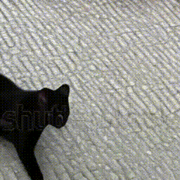
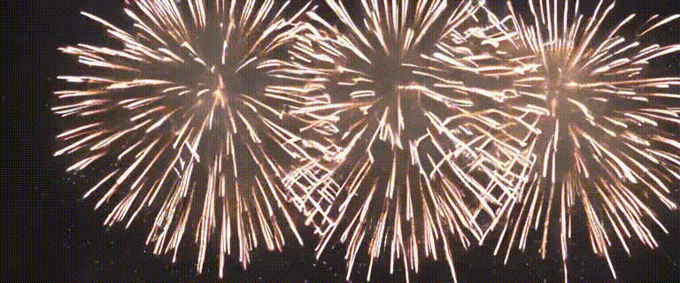

# Diffusion Generated Video Dataset and Detection Benchmark

## Video samples  
Modelscope video  
  
Zeroscope video  
  
SVD video  
  
I2VGen-xl video 

---
---

## Datasets

If you want to download the dataset, please mail for us zhengtp@mail.hfut.edu.cn

## Video generate

Please refer

`generate.sh`

## Video evaluation

We use `EvalCrafter` and `AIGCBench` to evaluate the video generation quantity  
You can see the code in `metrics/EvalCrafter` and `metrics/AIGCBench`

## Detection
The detection method we follow the `SlowFast`
